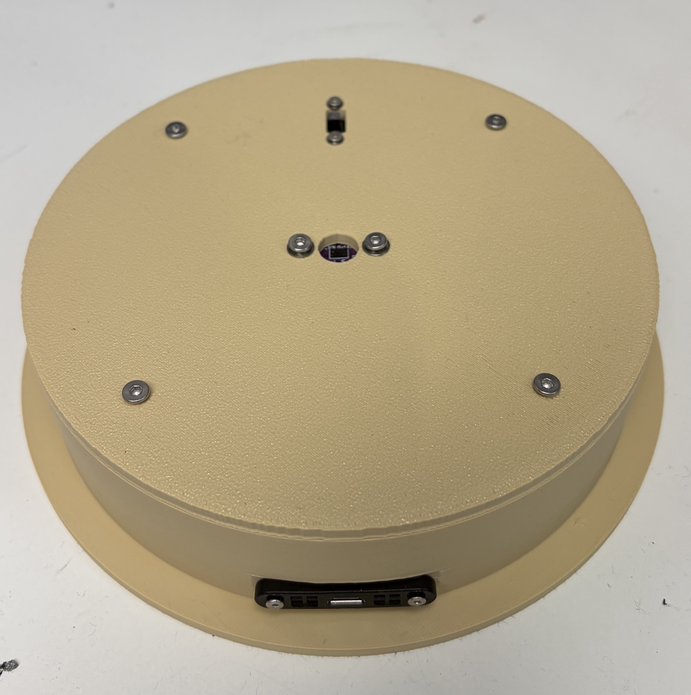
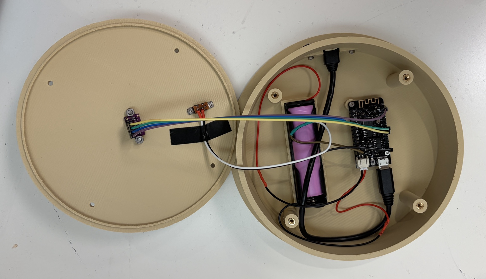
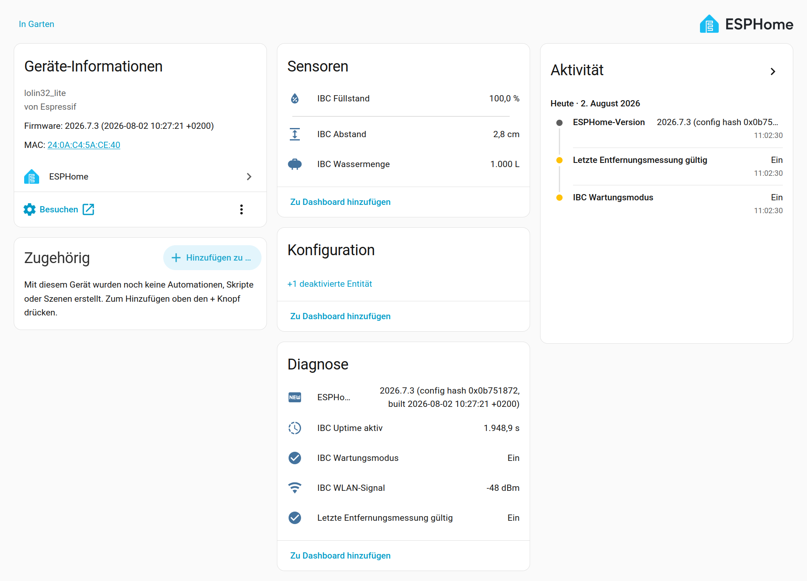

# IBC-Regenwassertank-Füllstandssensor

🌐 **Sprache:** [English](README.md) | **Deutsch**

[](https://esphome.io/)
[](https://www.home-assistant.io/)
[](LICENSE)

Ein batteriebetriebener, berührungsloser Füllstandssensor für einen **1.000-Liter-IBC-Regenwassertank** auf Basis eines **LOLIN32 Lite (ESP32)**, eines wasserdichten **DFRobot A02YYUW Ultraschallsensors**, ESPHome und Home Assistant.

> **Projektstatus:** In Entwicklung. Das Projekt wurde vom VL53L0X auf den A02YYUW umgestellt. ESPHome-Konfiguration und Verdrahtungsdokumentation sind bereits angepasst; das Gehäuse bzw. die Sensoraufnahme muss für den A02YYUW gegebenenfalls noch mechanisch angepasst werden.

<p align="center">
  
  
</p>

## Schnellzugriff

- [ESPHome-Konfiguration](esphome/ibc-fuellstand.yaml)
- [Beispiel für secrets.yaml](esphome/secrets.example.yaml)
- [3D-Druckdateien](3d/)
- [Aktuelle Verdrahtung](fritzing/README.md)
- [Lizenz](LICENSE)

## Warum dieses Projekt?

Von außen lässt sich bei einem IBC nur schwer erkennen, wie viel Regenwasser noch vorhanden ist. Der A02YYUW wird oben montiert und misst berührungslos den Abstand zur Wasseroberfläche. ESPHome berechnet daraus den Füllstand in Prozent und eine geschätzte Wassermenge in Litern und überträgt die Werte an Home Assistant.

Das Gehäuse mit dem Sensor wird einfach anstelle des originalen IBC-Deckels auf die vorhandene Deckelöffnung aufgelegt. Am IBC selbst sind dadurch keine dauerhaften Änderungen notwendig.

Der ESP32 läuft im Batteriebetrieb. Im Normalbetrieb wacht er auf, schaltet den A02YYUW ein, sammelt mehrere UART-Messwerte, veröffentlicht den Median und geht anschließend wieder in Deep Sleep. Der Ultraschallsensor wird dabei über einen fertigen **Pololu Mini MOSFET Slide Switch LV #2810** vollständig abgeschaltet, damit er während des Deep Sleep keinen unnötigen Strom verbraucht.

## Funktionen

- Wasserdichte, berührungslose Abstandsmessung mit **DFRobot A02YYUW**
- LOLIN32 Lite / ESP32
- UART-Auswertung mit 9600 Baud
- Medianfilter aus mehreren gültigen Messungen
- Füllstand in **%** und geschätzte Wassermenge in **Litern**
- Native ESPHome- und Home-Assistant-Integration
- Stromsparender Deep-Sleep-Betrieb
- Hardwareseitiges Abschalten des A02YYUW mit **Pololu 2810**
- Physischer Wartungsschalter
- OTA-Updates im Wartungsmodus
- WLAN- und Diagnose-Sensoren

## Hardware

| Komponente | Verwendung | Link |
|---|---|---|
| LOLIN32 Lite | ESP32-Controller mit Akkuanschluss | [Amazon.de](https://link.amazon/B08XCjKmW) |
| DFRobot A02YYUW | Wasserdichte Ultraschall-Abstandsmessung | [Amazon.de](https://link.amazon/B0dWRfbC4) |
| **Pololu Mini MOSFET Slide Switch with Reverse Voltage Protection, LV #2810** | A02YYUW während Deep Sleep vollständig abschalten | [Pololu](https://www.pololu.com/product/2810) |
| 18650-Batteriehalter | Halter für eine austauschbare 3,7-V-18650-Li-Ion-Zelle | [Amazon.de](https://link.amazon/B01DdEQ1R) |
| JST-PH 2-Pin-Stecker / Kabel | Verbindung zwischen Batteriehalter und LOLIN32 Lite; **Polarität unbedingt prüfen** | [Amazon.de](https://link.amazon/B0gWDZhb8) |
| Schiebeschalter | Physischer Wartungs-/No-Sleep-Schalter | [Amazon.de](https://link.amazon/B07UrAODV) |
| Micro-USB-Verlängerung / Einbaubuchse | Externes Laden, Programmieren und USB-Zugriff | [Amazon.de](https://link.amazon/B010nKBUo) |
| Gewindeeinsätze zum Einschmelzen | Gewindepunkte im 3D-gedruckten Gehäuse | [Amazon.de](https://link.amazon/B04F2Wwbw) |
| Schrauben | Befestigung von Elektronik und Gehäuseteilen | [Amazon.de](https://link.amazon/B0b1rHkyN) |
| 3D-gedrucktes Gehäuse | Montage am IBC | [3D-Dateien](3d/) |

### Affiliate-Hinweis

Einige der oben genannten Links sind Amazon-Partnerlinks. Für dich entstehen dadurch keine zusätzlichen Kosten.

**Als Amazon-Partner verdiene ich an qualifizierten Verkäufen.**

## A02YYUW

Der A02YYUW arbeitet mit **3,3–5 V**, liefert seine Messwerte per UART mit **9600 Baud** und benötigt im Mittel nur wenige Milliampere. Trotzdem würde er bei einem Gerät, das den größten Teil der Zeit schläft, den Akku unnötig belasten, wenn er permanent eingeschaltet bleibt.

Der **RX-Pin des A02YYUW bleibt unbeschaltet**. Dadurch arbeitet der Sensor im geglätteten/processed output mode. Der **TX-Pin des Sensors** wird mit dem RX-Pin des ESP32 verbunden.

## Verdrahtung

### A02YYUW und Pololu 2810 → LOLIN32 Lite

Für den automatischen Betrieb bleibt der mechanische Schiebeschalter auf dem Pololu-Modul in Stellung **OFF**. Der ESP32 schaltet den Sensor dann über den `ON`-Eingang des Moduls.

```text
LOLIN32 3.3 V -------- VIN   Pololu 2810
LOLIN32 GND   -------- GND   Pololu 2810
GPIO17        -------- ON    Pololu 2810
Pololu VOUT   -------- VCC   A02YYUW
A02YYUW GND   -------- GND
A02YYUW TX    -------- GPIO16
A02YYUW RX    -------- nicht anschließen
```

Damit gilt:

- **GPIO17 HIGH:** A02YYUW eingeschaltet
- **GPIO17 LOW:** A02YYUW ausgeschaltet
- im Deep Sleep bleibt der A02YYUW stromlos

Die jeweils aktuelle Verdrahtung ist zusätzlich unter [`fritzing/README.md`](fritzing/README.md) dokumentiert.

### Wartungsschalter

```text
GPIO13 ---- Schalter ---- GND
```

GPIO13 verwendet den internen Pull-up-Widerstand.

- **Schalter offen:** Normalbetrieb / Deep Sleep aktiv
- **Schalter geschlossen:** Wartungsmodus / ESP32 bleibt wach

Alle Masseverbindungen müssen gemeinsam verbunden sein.

## ESPHome

Die aktuelle Konfiguration befindet sich hier:

**[esphome/ibc-fuellstand.yaml](esphome/ibc-fuellstand.yaml)**

Wichtige Pins:

```yaml
substitutions:
  a02_rx_pin: GPIO16
  a02_power_pin: GPIO17

# Wartungsschalter:
# GPIO13 -> switch -> GND
```

### Messverfahren

Im Normalbetrieb läuft der Zyklus ungefähr so ab:

```text
Aufwachen
→ A02YYUW einschalten
→ kurze Einschwingzeit
→ mehrere gültige UART-Messungen sammeln
→ Median bilden
→ Abstand, Prozent und Liter veröffentlichen
→ A02YYUW ausschalten
→ Deep Sleep
```

Im Wartungsmodus bleibt der ESP32 wach und erzeugt fortlaufend neue Messwerte. Das voreingestellte Schlafintervall beträgt derzeit **15 Minuten**.

## Einrichtung

1. In Home Assistant den **ESPHome Device Builder** installieren.
2. Ein Gerät `ibc-fuellstand` anlegen.
3. [`esphome/secrets.example.yaml`](esphome/secrets.example.yaml) als Vorlage für WLAN-, API- und OTA-Zugangsdaten verwenden.
4. Die generierte YAML durch [`esphome/ibc-fuellstand.yaml`](esphome/ibc-fuellstand.yaml) ersetzen.
5. Für die erste Einrichtung den Wartungsschalter schließen, damit GPIO13 mit GND verbunden ist und der ESP32 wach bleibt.
6. Firmware zunächst per USB flashen.
7. ESPHome-Gerät in Home Assistant hinzufügen und anschließend die Distanzwerte prüfen.

## Kalibrierung

Die Beispielwerte müssen an die tatsächliche Installation angepasst werden:

```yaml
substitutions:
  tank_capacity_l: "1000"
  distance_empty_cm: "100"
  distance_full_cm: "10"
  sleep_time: "15min"
```

Den Sensor in seiner endgültigen Position montieren und den gemessenen Abstand bei bekanntem vollem und leerem Tank notieren. Werte außerhalb des kalibrierten Bereichs werden auf 0–100 % begrenzt.

## Home Assistant

Typische Entitäten sind:

- **IBC Abstand**
- **IBC Füllstand**
- **IBC Wassermenge**
- **IBC WLAN-Signal**
- **IBC Uptime aktiv**
- **IBC Wartungsmodus**
- **Letzte Entfernungsmessung gültig**
- **ESPHome-Version**

Während des Deep Sleep ist das ESPHome-Gerät zeitweise offline. Home Assistant behält die zuletzt erfolgreich gemeldeten Werte bei.

### Beispielansicht



## 3D-gedrucktes Gehäuse

Das vorhandene Gehäuse wurde ursprünglich für den VL53L0X entwickelt. Durch den Wechsel auf den A02YYUW muss insbesondere die Sensoraufnahme im Deckel überprüft beziehungsweise angepasst werden.

Vorhandene Dateien:

- **Basis:** [`3d/IBCLEVEL_BASE_v38.stl`](3d/IBCLEVEL_BASE_v38.stl)
- **Deckel:** [`3d/IBCLEVEL_LID_v26.zip`](3d/IBCLEVEL_LID_v26.zip)

Die vorhandenen Dateien sind deshalb aktuell als **Prototypen** zu betrachten.

## Akku und Sicherheit

Eine geeignete 3,7-V-18650-Li-Ion-Zelle kann verwendet werden, sofern sie in gutem Zustand ist. Keine beschädigten, aufgeblähten oder überhitzten Zellen verwenden.

**Vor dem Anschluss des Akkus unbedingt die Polarität des JST-Steckers prüfen.** Beim LOLIN32 Lite kann die Belegung gegenüber fertig konfektionierten JST-PH-Kabeln vertauscht sein. Nicht allein auf Kabelfarbe oder Steckerorientierung verlassen.

Elektronik und Akku müssen vor Regen, Kondenswasser und anderen Umwelteinflüssen geschützt werden. Ein 3D-gedrucktes Gehäuse ist nicht automatisch wasserdicht.

## Unterstützung

[](https://paypal.me/toor0001/5)

## Mitmachen

Issues, Vorschläge und Verbesserungen sind willkommen. Besonders hilfreich sind Rückmeldungen von Nachbauten mit anderen IBC-Tanks oder Montagevarianten.

## Lizenz

Quellcode und Dokumentation stehen, soweit nicht anders angegeben, unter der [MIT-Lizenz](LICENSE). Für die 3D-Modelle kann zukünftig eine separate Lizenz ergänzt werden.
