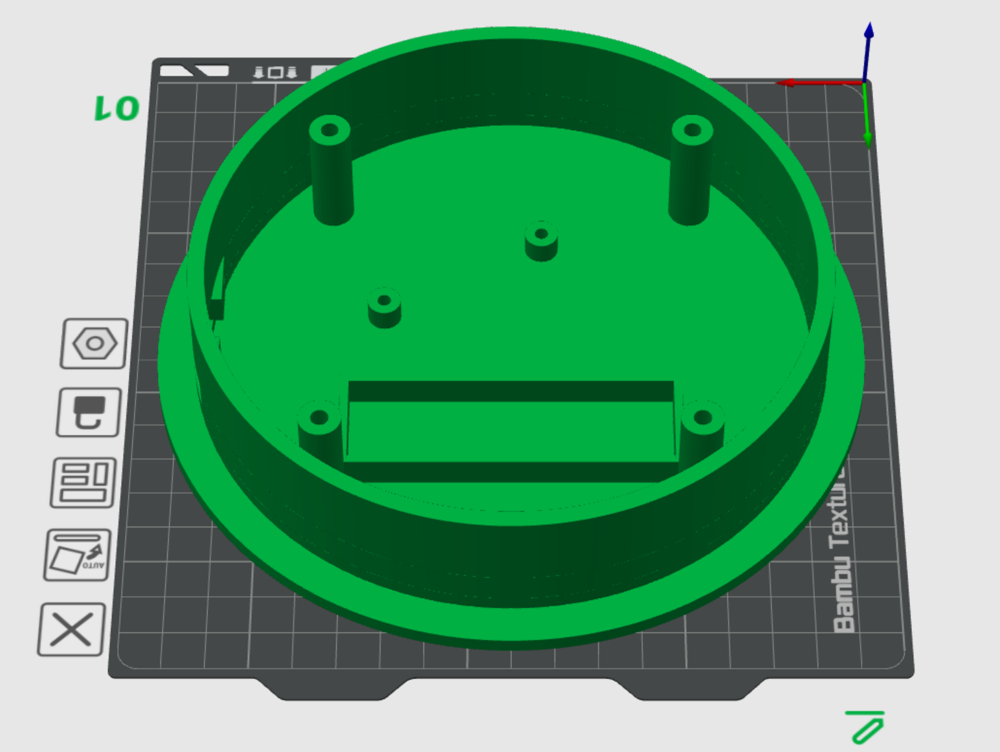

# IBC-Regenwassertank-Füllstandssensor

🌐 **Sprache:** [English](README.md) | **Deutsch**

[](https://esphome.io/)
[](https://www.home-assistant.io/)
[](LICENSE)

Ein batteriebetriebener, berührungsloser Füllstandssensor für einen **1.000-Liter-IBC-Regenwassertank** auf Basis eines **LOLIN32 Lite (ESP32)**, eines **VL53L0X Time-of-Flight-Sensors**, ESPHome und Home Assistant.

> **Projektstatus:** In Entwicklung. Elektronik, ESPHome-Konfiguration und der aktuelle Gehäuse-Prototyp sind verfügbar; die endgültige IBC-Kalibrierung und Langzeittests stehen noch aus.

<p align="center">
  
  
</p>

## Schnellzugriff

- [ESPHome-Konfiguration](esphome/ibc-fuellstand.yaml)
- [Beispiel für secrets.yaml](esphome/secrets.example.yaml)
- [3D-Druckdateien](3d/)
- [Verdrahtung / Fritzing](fritzing/)
- [Lizenz](LICENSE)

## Warum dieses Projekt?

Ich verwende im Garten einen 1.000-Liter-IBC-Container zum Sammeln von Regenwasser. Von außen lässt sich jedoch nur schwer erkennen, wie viel Wasser noch vorhanden ist.

Der VL53L0X wird oben am Tank montiert und misst berührungslos den Abstand zur Wasseroberfläche. ESPHome rechnet diesen Abstand in einen Füllstand in Prozent und eine geschätzte Wassermenge in Litern um und überträgt die Werte an Home Assistant.

Der ESP32 ist für Batteriebetrieb ausgelegt. Im normalen Betrieb wacht er auf, führt mehrere Messungen durch, veröffentlicht einen gefilterten Messwert und geht anschließend wieder in Deep Sleep. Ein physischer Wartungsschalter hält ihn für Kalibrierung, Logs und OTA-Updates dauerhaft wach.

## Funktionen

- Berührungslose Abstandsmessung mit VL53L0X Time-of-Flight-Sensor
- LOLIN32 Lite / ESP32
- Native ESPHome- und Home-Assistant-Integration
- Füllstand in **%** und geschätzte Wassermenge in **Litern**
- Rohwert des Abstands zur Kalibrierung
- Medianfilter aus 11 Messwerten
- Stromsparender Deep-Sleep-Betrieb
- Physischer Wartungsschalter
- OTA-Updates im Wartungsmodus
- WLAN- und Diagnose-Sensoren
- Eigenes 3D-druckbares Gehäuse

## Hardware

| Komponente | Verwendung | Link |
|---|---|---|
| LOLIN32 Lite | ESP32-Controller mit Akkuanschluss | [Amazon.de](https://link.amazon/B08XCjKmW) |
| VL53L0X Time-of-Flight-Sensor | Berührungslose Abstandsmessung | [Amazon.de](https://link.amazon/B0c7CzOGX) |
| 18650-Batteriehalter | Halter für eine austauschbare 3,7-V-18650-Li-Ion-Zelle | [Amazon.de](https://link.amazon/B01DdEQ1R) |
| JST-PH 2-Pin-Stecker / Kabel | Verbindung zwischen Batteriehalter und LOLIN32 Lite; **Polarität unbedingt prüfen** | [Amazon.de](https://link.amazon/B0gWDZhb8) |
| Schiebeschalter | Physischer Wartungs-/No-Sleep-Schalter | [Amazon.de](https://link.amazon/B07UrAODV) |
| Micro-USB-Verlängerung / Einbaubuchse | Externes Laden, Programmieren und USB-Zugriff | [Amazon.de](https://link.amazon/B010nKBUo) |
| Gewindeeinsätze zum Einschmelzen | Gewindepunkte im 3D-gedruckten Gehäuse | [Amazon.de](https://link.amazon/B04F2Wwbw) |
| Schrauben | Befestigung von Elektronik und Gehäuseteilen | [Amazon.de](https://link.amazon/B0b1rHkyN) |
| 3D-gedrucktes Gehäuse | Montage am IBC | [3D-Dateien](3d/) |

### Gewindeeinsätze zum Einschmelzen

Das aktuelle Gehäuse verwendet zwei Größen aus dem gezeigten Heat-Set-Insert-Sortiment:

- **Elektronik / kleine Befestigungspunkte:** M2 × 3 × 3,2 mm.
- **Befestigung des Deckels an der Basis:** M3 × 5 × 5 mm.

Als praktischer Ausgangspunkt für die gedruckten Aufnahmebohrungen eignen sich ungefähr **Ø 3,0 mm × 3,5 mm tief für M2** und **Ø 4,6–4,7 mm × 5,5 mm tief für M3**. Die optimale Passung hängt von Filament, Druckerkalibrierung und der tatsächlichen Geometrie der Einsätze ab. Deshalb empfiehlt sich vor dem endgültigen Druck ein kleines Teststück.

Für PLA/PETG ist ein Bereich von etwa **200–220 °C** ein sinnvoller Ausgangspunkt; **210 °C** eignet sich für diesen Aufbau als Startwert. Den Einsatz mit Lötkolben bzw. Heat-Set-Spitze langsam und gerade einschmelzen und nicht mit Gewalt hineindrücken. Vor dem Einschrauben vollständig abkühlen lassen.

### Akku-Option

Eine geeignete **3,7-V-18650-Li-Ion-Zelle kann auch aus einer alten oder günstigen Mini-Powerbank wiederverwendet werden**, sofern es sich um eine normale einzelne 18650-Zelle in gutem Zustand handelt. Verwende nur unbeschädigte Zellen ohne Aufblähungen, Korrosion, Überhitzungsspuren oder andere Auffälligkeiten. Spannung und Zustand sollten vor der Verwendung geprüft werden.

### ⚠️ Wichtig: Polarität des Akku-Steckers

**Den Akku erst anschließen, nachdem die Polarität geprüft wurde.** Der 2-polige Akkuanschluss des hier verwendeten LOLIN32 Lite ist gegenüber vielen fertig konfektionierten JST-PH-Kabeln offenbar umgekehrt belegt. Auf der verwendeten Platine ist der **`+`-Pol direkt neben der Akkubuchse auf der Platine markiert**. Bei dem hier verwendeten Standard-Anschlusskabel würde an dieser Position sonst das **schwarze Minus-Kabel** liegen.

Vor dem Einstecken deshalb die Position der Leitungen mit der `+`-Markierung auf dem eigenen Board vergleichen. Falls nötig, die Kontakte im Steckergehäuse tauschen oder den Batteriehalter entsprechend verdrahten. **Nicht allein auf Kabelfarbe oder Steckerorientierung verlassen. Eine Verpolung kann das Board beschädigen.**

### Affiliate-Hinweis

Einige der oben genannten Links sind Amazon-Partnerlinks. Für dich entstehen dadurch keine zusätzlichen Kosten.

**Als Amazon-Partner verdiene ich an qualifizierten Verkäufen.**

## Verdrahtung

### VL53L0X → LOLIN32 Lite

| VL53L0X | LOLIN32 Lite |
|---|---|
| VCC | 3.3 V |
| GND | GND |
| SDA | GPIO16 |
| SCL | GPIO17 |

### Wartungsschalter

```text
GPIO13 ---- Schalter ---- GND
```

GPIO13 verwendet den internen Pull-up-Widerstand.

- **Schalter offen:** Normalbetrieb / Deep Sleep aktiv
- **Schalter geschlossen:** Wartungsmodus / ESP32 bleibt wach

### Gemeinsamer GND-Anschluss

Der für dieses Projekt verwendete LOLIN32 Lite bietet nur **einen bequem nutzbaren GND-Pin**, während sowohl der VL53L0X als auch der Wartungsschalter eine Masseverbindung benötigen. Beide teilen sich deshalb denselben GND-Anschluss.

Dafür kann man ein kleines **Y-Kabel** vom GND-Pin des LOLIN32 Lite zu den beiden Masseleitungen bauen. Alternativ können die GND-Litze des Sensors und die GND-Litze des Schalters zusammengelötet und gemeinsam mit dem einzigen GND-Pin verbunden werden. Die Verbindung anschließend sauber isolieren, z. B. mit Schrumpfschlauch, und mechanisch sicher ausführen.

```text
                 +---- VL53L0X GND
LOLIN32 Lite GND-+
                 +---- Wartungsschalter
```

Ein Fritzing-Projekt und ein exportierter Verdrahtungsplan sind für den Ordner [`fritzing`](fritzing/) vorgesehen.

## ESPHome

Die vollständige aktuelle Konfiguration befindet sich hier:

**[esphome/ibc-fuellstand.yaml](esphome/ibc-fuellstand.yaml)**

Erstelle deine eigene `secrets.yaml` anhand von [esphome/secrets.example.yaml](esphome/secrets.example.yaml). Echte WLAN-Passwörter, API-Schlüssel und OTA-Passwörter niemals in ein öffentliches GitHub-Repository hochladen.

Wichtige Pinbelegung:

```yaml
i2c:
  sda: GPIO16
  scl: GPIO17

# Physischer Wartungsschalter
# GPIO13 -> Schalter -> GND
```

### Messverfahren

Der VL53L0X misst im Wachzustand alle **500 ms**. Elf gültige Werte werden gesammelt und anschließend der Median veröffentlicht. Im dauerhaften Wartungsmodus entsteht dadurch ungefähr alle **5,5 Sekunden** ein neuer gefilterter Messwert.

## Einrichtung in Home Assistant und ESPHome

Die folgenden Schritte gehen von einer Home-Assistant-Installation aus, die Add-ons unterstützt, beispielsweise Home Assistant OS oder Home Assistant Supervised.

### 1. ESPHome installieren

In Home Assistant öffnen:

**Einstellungen → Add-ons → Add-on Store**

Nach **ESPHome Device Builder** suchen, installieren und anschließend starten. Empfehlenswert sind außerdem **Beim Start starten** und optional **In Seitenleiste anzeigen**.

### 2. Neues ESPHome-Gerät anlegen

ESPHome Device Builder öffnen und **New device / Neues Gerät** auswählen. Als Gerätenamen beispielsweise verwenden:

```text
ibc-fuellstand
```

Die automatisch erzeugte YAML ist nicht wichtig, da sie anschließend durch die Projektkonfiguration ersetzt wird.

### 3. Secrets eintragen

Die ESPHome-Datei `secrets.yaml` öffnen und WLAN-Zugangsdaten, API-Verschlüsselungsschlüssel und OTA-Passwort eintragen.

Als Vorlage dient [`esphome/secrets.example.yaml`](esphome/secrets.example.yaml):

```yaml
wifi_ssid: "DEIN_WLAN_NAME"
wifi_password: "DEIN_WLAN_PASSWORT"
api_encryption_key: "DEIN_API_ENCRYPTION_KEY"
ota_password: "DEIN_OTA_PASSWORT"
```

Die echte `secrets.yaml` niemals in das öffentliche GitHub-Repository kopieren.

### 4. YAML-Konfiguration übernehmen

Die Konfiguration des neu angelegten ESPHome-Geräts öffnen und den Inhalt durch folgende Datei ersetzen:

**[esphome/ibc-fuellstand.yaml](esphome/ibc-fuellstand.yaml)**

Vor der Installation die Werte am Anfang der Datei prüfen und bei Bedarf anpassen:

```yaml
substitutions:
  device_name: ibc-fuellstand
  friendly_name: "IBC Füllstand"
  tank_capacity_l: "1000"
  distance_empty_cm: "100"
  distance_full_cm: "10"
  sleep_time: "15min"
```

Die Werte für voll und leer sind Kalibrierwerte und sollten später an den tatsächlichen Tank und die Einbauhöhe angepasst werden.

### 5. Gerät bei der Ersteinrichtung wach halten

Für Installation und Tests den Wartungsschalter **einschalten**, sodass **GPIO13 mit GND verbunden** ist. Dadurch geht der ESP32 während Flashen, Logs oder OTA-Updates nicht in Deep Sleep.

Für den ersten Sensortest kann unter `i2c:` vorübergehend

```yaml
scan: false
```

in

```yaml
scan: true
```

geändert werden. Der VL53L0X sollte normalerweise unter der Adresse **0x29** gefunden werden.

### 6. Firmware auf den LOLIN32 Lite installieren

Für den ersten Flash den LOLIN32 Lite per USB mit dem Computer bzw. Home-Assistant-System verbinden. Im ESPHome Device Builder **Installieren** auswählen und die für das eigene System passende USB-/serielle Installationsmethode verwenden.

Nach dem ersten erfolgreichen Flash sollte sich das Gerät mit dem WLAN verbinden. Spätere Aktualisierungen können normalerweise per **OTA** durchgeführt werden, solange der Wartungsschalter das Gerät wach hält.

### 7. ESPHome-Gerät zu Home Assistant hinzufügen

Sobald der ESP32 online ist, wird er von Home Assistant normalerweise automatisch erkannt.

Öffnen:

**Einstellungen → Geräte & Dienste**

Nach dem neu erkannten **ESPHome**-Gerät **IBC Füllstand** suchen und **Konfigurieren / Hinzufügen** auswählen.

Falls es nicht automatisch erkannt wird, die **ESPHome-Integration** manuell hinzufügen und Hostname oder IP-Adresse eingeben, zum Beispiel:

```text
ibc-fuellstand.local
```

oder die lokale IP-Adresse des ESP32. Die native ESPHome-API verwendet standardmäßig Port **6053**.

Fragt Home Assistant nach dem Verschlüsselungsschlüssel, denselben `api_encryption_key` verwenden, der in `secrets.yaml` hinterlegt wurde.

### 8. Entitäten prüfen

Nach dem Hinzufügen sollten automatisch unter anderem folgende Entitäten erscheinen:

- **IBC Abstand** — gemessener Abstand zur Wasseroberfläche
- **IBC Füllstand** — berechneter Füllstand in Prozent
- **IBC Wassermenge** — geschätzte Wassermenge in Litern
- **IBC WLAN-Signal** — WLAN-Signalstärke
- **IBC Uptime aktiv** — Wachzeit des aktuellen Messzyklus
- **IBC Wartungsmodus** — Zustand des physischen Wartungsschalters
- **Letzte Entfernungsmessung gültig** — Messdiagnose
- **ESPHome-Version** — installierte ESPHome-Firmwareversion

**IBC Füllstand** und/oder **IBC Wassermenge** können anschließend wie normale Sensoren zu einem Home-Assistant-Dashboard hinzugefügt werden.

### 9. Normalen Deep-Sleep-Betrieb aktivieren

Wenn alles funktioniert:

1. Falls aktiviert, `scan: false` wieder setzen.
2. Bei Bedarf die endgültige YAML noch einmal installieren.
3. Wartungsschalter öffnen, sodass GPIO13 nicht mehr mit GND verbunden ist.

Der ESP32 wacht nun auf, misst, sendet die Werte an Home Assistant und geht für das konfigurierte Intervall wieder in Deep Sleep.

Während des Deep Sleep ist es **normal, dass das ESPHome-Gerät zeitweise als offline erscheint**. Home Assistant zeigt weiterhin die zuletzt erfolgreich empfangenen Sensorwerte an.

## Deep Sleep

Normalbetrieb:

```text
Aufwachen → messen → Medianfilter → % / Liter berechnen
          → an Home Assistant senden → Deep Sleep
```

Das voreingestellte Schlafintervall beträgt derzeit **15 Minuten**.

Bei aktiviertem Wartungsschalter wird Deep Sleep übersprungen. WLAN, ESPHome-API und OTA bleiben dadurch für Kalibrierung und Fehlersuche erreichbar.

## Kalibrierung

Die Beispielwerte in der YAML müssen an die tatsächliche Installation angepasst werden:

```yaml
substitutions:
  tank_capacity_l: "1000"
  distance_empty_cm: "100"
  distance_full_cm: "10"
  sleep_time: "15min"
```

Für eine gute Kalibrierung den Sensor in seiner endgültigen Position montieren, Wartungsmodus aktivieren und den Rohabstand bei bekanntem vollen und leeren Zustand notieren. Werte außerhalb des kalibrierten Bereichs werden auf 0–100 % begrenzt.

## Home Assistant

Home Assistant sollte das Gerät normalerweise automatisch über die ESPHome-Integration erkennen. Während der ESP32 schläft, ist die ESPHome-API nicht erreichbar. Das ist normal; Home Assistant behält die zuletzt gemeldeten Sensorwerte bei.

### Beispielansicht

Der folgende Screenshot zeigt das aktuelle ESPHome-Gerät in Home Assistant mit berechnetem Füllstand, Wassermenge und Diagnosewerten.


## Erste Inbetriebnahme

Für den ersten Test den Wartungsschalter schließen, sodass GPIO13 mit GND verbunden ist. Der ESP32 bleibt dadurch wach. I²C-Scanning vorübergehend aktivieren:

```yaml
i2c:
  sda: GPIO16
  scl: GPIO17
  scan: true
```

Der VL53L0X sollte normalerweise unter **0x29** erscheinen. Wenn Sensor, Home-Assistant-Integration und OTA geprüft wurden, `scan: false` wieder setzen.

## 3D-gedrucktes Gehäuse

Für das Projekt wurde ein eigenes Gehäuse konstruiert und mit der realen Hardware getestet. Es bietet Platz für LOLIN32 Lite, Akku, externen USB-Anschluss und Wartungsschalter. Der VL53L0X sitzt im Deckel und misst nach unten in den IBC.

Das Gehäuse wurde mit einem **Bambu Lab A1 mini** vorbereitet und testweise gedruckt.



### Verfügbare Dateien

- **Basis:** [`3d/IBCLEVEL_BASE_v38.stl`](3d/IBCLEVEL_BASE_v38.stl)
- **Deckel:** [`3d/IBCLEVEL_LID_v26.zip`](3d/IBCLEVEL_LID_v26.zip) — ZIP vor dem Import in den Slicer entpacken.

Der Deckel liegt als ZIP vor, weil die hochauflösende STL-Datei das normale Größenlimit für den Upload über die GitHub-Weboberfläche überschreitet. Das Archiv enthält die unveränderte STL-Geometrie.

Das Gehäuse gilt bis zum Abschluss der endgültigen Passform- und Außentests weiterhin als Prototyp. Vor einem finalen Druck Maße und Passform prüfen.

## Stromverbrauch

Ein niedriger Stromverbrauch ist ein wichtiges Ziel. Die tatsächliche Akkulaufzeit hängt unter anderem von Akkukapazität, WLAN-Signal, Verbindungsdauer, Messdauer, Schlafintervall und Ruhestrom der gesamten Elektronik ab. Reale Laufzeitdaten werden nach den Langzeittests ergänzt.

## Projekt unterstützen

IBCLEVEL ist ein Open-Source-Hobbyprojekt. Wenn dir das Projekt hilft und du die weitere Entwicklung, Tests und Dokumentation unterstützen möchtest, kannst du freiwillig einen Beitrag über PayPal senden.

<a href="https://paypal.me/toor0001">
  
</a>

Die Unterstützung ist vollständig freiwillig und wird nicht als steuerlich abzugsfähige Spende dargestellt.

## Sicherheit und Außeneinsatz

Dies ist ein DIY-Projekt. Die Elektronik muss angemessen vor Regen, Kondenswasser und anderen Umwelteinflüssen geschützt werden. Ein 3D-gedrucktes Gehäuse ist nicht automatisch wasserdicht.

Li-Ion-Akkus erfordern einen geeigneten Umgang beim Laden, Betrieb und bei Temperaturschwankungen. Keine beschädigten Akkus verwenden und vor dem Anschluss immer die Polarität prüfen.

## Mitmachen

Issues, Vorschläge und Verbesserungen sind willkommen. Besonders hilfreich sind Rückmeldungen von Nachbauten mit anderen IBC-Tanks oder Montagevarianten.

## Lizenz

Quellcode und Dokumentation stehen, soweit nicht anders angegeben, unter der [MIT-Lizenz](LICENSE). Für die 3D-Modelle kann zukünftig eine separate Lizenz ergänzt werden.

---

Entstanden als praktische DIY-Lösung zur Überwachung des Regenwasservorrats in einem Garten-IBC mit ESPHome und Home Assistant.
